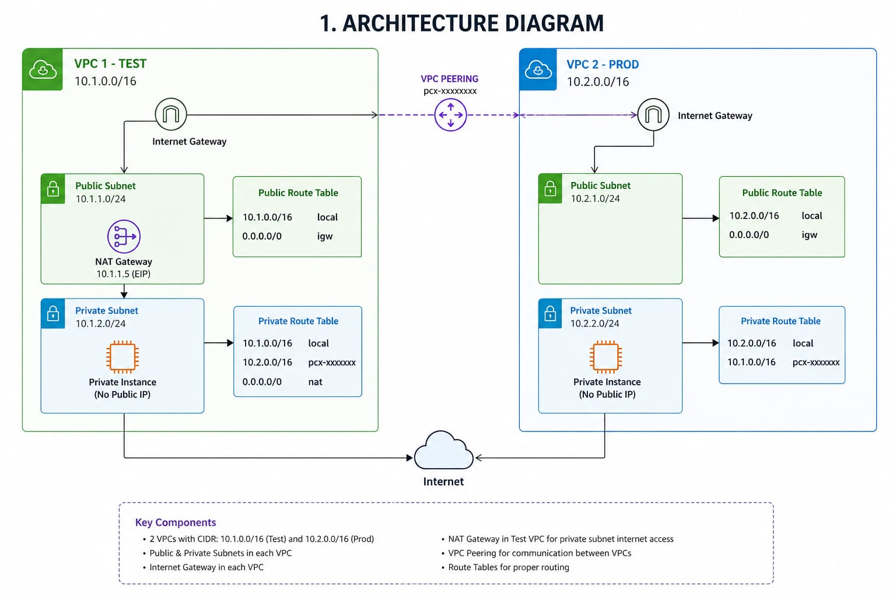
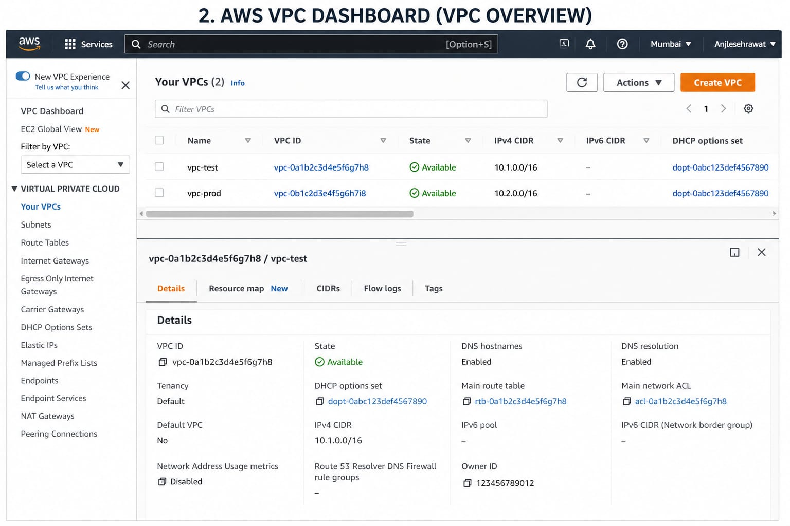
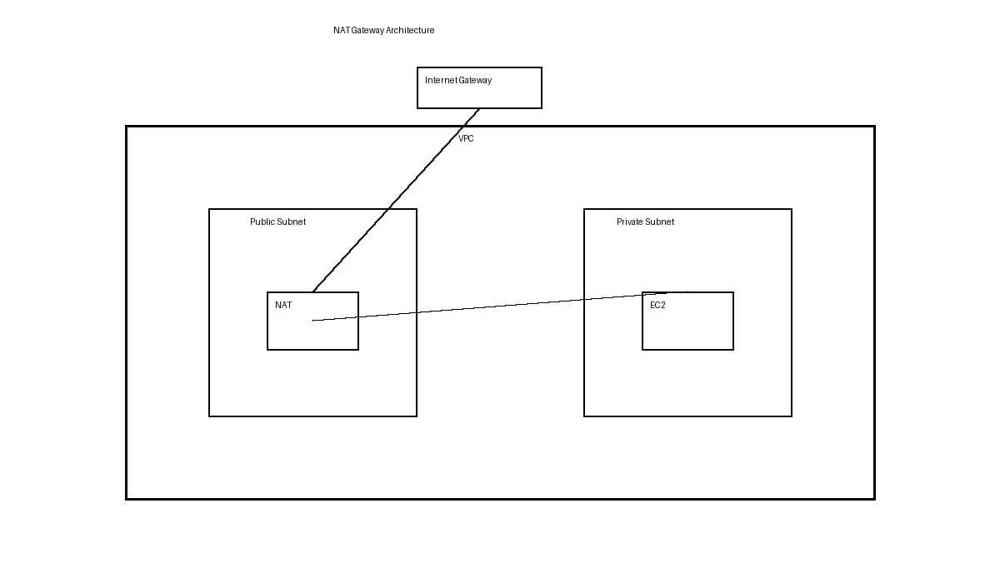

# 🌐 AWS VPC Peering with NAT Gateway (Terraform)

##  Project Overview
This project demonstrates how to build a secure and scalable AWS network 
using **Terraform**, including:
- VPC to VPC Peering
- Public & Private Subnets
- NAT Gateway for private internet access

---

## ️ Architecture Diagram

### 🔹 VPC Architecture


### 🔹 VPC Peering Connection


### 🔹 NAT Gateway Setup


---

## ⚙️ Infrastructure Components

- ✅ 2 VPCs (Test & Prod)
- ✅ Public Subnet (Internet accessible)
- ✅ Private Subnet (secured)
- ✅ Internet Gateway
- ✅ NAT Gateway
- ✅ VPC Peering Connection
- ✅ Route Tables & Associations

---

##  Features

- Infrastructure as Code using Terraform
- Secure communication between two VPCs
- Private subnet internet access via NAT Gateway
- Scalable and modular architecture

---

## ️ Tech Stack

- AWS (VPC, EC2, Networking)
- Terraform

---

##  Project Structure

├── provider.tf ├── vpc.tf ├── subnet.tf ├── igw_nat.tf ├── 
peering.tf ├── route.tf ├── association.tf ├── README.md └── 
images/ ├── vpc.png ├── peering.png └── 
nat_gateway_architecture.png

---

## ▶️ How to Use

### 1️⃣ Initialize Terraform
```bash
terraform init
2️⃣ Plan Infrastructure
Bash
terraform plan
3️⃣ Apply Changes
Bash
terraform apply
4️⃣ Destroy Infrastructure (to avoid charges)
Bash
terraform destroy


Author : AnjleSehrawat
